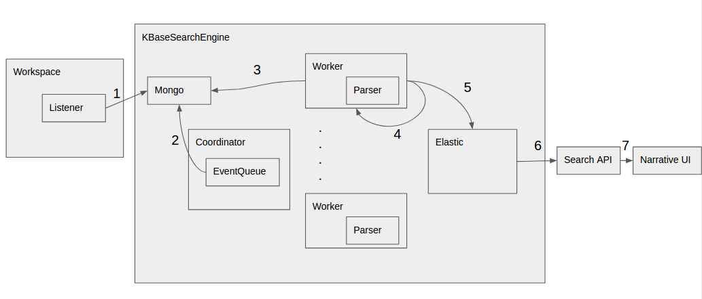
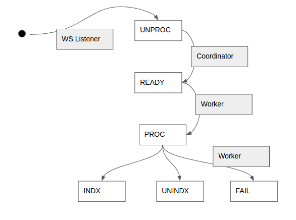

Architecture - High Level Design
=================================

.. _fig-main:

    KBaseSearchEngine component diagram.

    Event state transition diagram.

Data Flow
---------
1. The workspace pushes workspace level, object level and version level events into the KBaseSearchEngine Mongodb instance. The initial state of the events is UNPROC (or unprocessed).

2. The EventQueue periodically fetches events from the database and sets those that can be processed into a READY state. The EventQueue is a three-level blocking queue that blocks events that may cause an out-of-order update on the index. For example, an object level event like "rename" must block another object level event like "delete". i.e. these two events cannot be executed in parallel by the workers. Also, importantly, the queue prevents simultaneous updates on the same document in ElasticSearch, which can cause update conflicts.

3. The workers pull events that are READY for processing, set their state to PROCESSING in the database instance and begin processing the event.

4. If the processing of an event fails due to network connectivity or other such recoverable issues, the event is reprocessed using a Retrier. The Retrier retries an event a finite number of times before setting the event processing state as FAILED in the mongo instance. A log is written out when processing of an event fails.

5. Once the event has been processed successfully, the corresponding object is (re-)indexed into the ElasticSearch index and the event state in the mongo instance is set to INDX (or indexed).

6&7. Queries from the narrative UI are serviced by the search API which in turn makes queries to the ElasticSearch index.